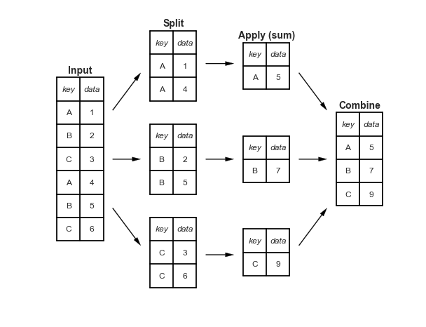

## Grouping

An essential piece of analysis of large data is efficient summarization: computing aggregations like sum(), mean(), median(), min(), and max(), in which a single number gives insight into the nature of a potentially large dataset. In this section, we'll explore aggregations in Pandas, from simple operations akin to what we've seen on NumPy arrays, to more sophisticated operations based on the concept of a groupby.

```{r setup, include=FALSE}
library(reticulate)
reticulate::repl_python()
```

# simple aggregation functions in Pandas

```{python}
import numpy as np
import pandas as pd

# series example
rng = np.random.RandomState(42)
ser = pd.Series(rng.rand(5))
ser


ser.sum()
ser.mean()

# dataframe example
df = pd.DataFrame({'A': rng.rand(5),
                   'B': rng.rand(5)})
df

df.mean()
df.mean(axis=1) # row mean
df.sum()
```

# GroupBy: Split, Apply, Combine
Simple aggregations can give you a flavor of your dataset, but often we would prefer to aggregate conditionally on some label or index: this is implemented in the so-called groupby operation which involves three steps:

- The split step involves breaking up and grouping a DataFrame depending on the value of the specified key.

- The apply step involves computing some function, usually an aggregate, transformation, or filtering, within the individual groups.

- The combine step merges the results of these operations into an output array.



```{python}
df = pd.DataFrame({'key': ['A', 'B', 'C', 'A', 'B', 'C'],
                   'data': range(6)}, columns=['key', 'data'])
df
df.groupby('key')
df.groupby('key').sum()

df_mix = pd.DataFrame({'key': ['A', 'B', 'C', 'A', 'B', 'C'],
                   'data': range(6), 'function':['R&D', 'HR', 'HR', 'R&D', 'HR', 'HR']}, columns=['key', 'data', 'function'])
df_mix
df.groupby('key').sum() # only numeric variables
```

## Aggregate, filter, transform, apply

GroupBy objects have aggregate(), filter(), transform(), and apply() methods that efficiently implement a variety of useful operations before combining the grouped data.

```{python}
rng = np.random.RandomState(0)
df = pd.DataFrame({'key': ['A', 'B', 'C', 'A', 'B', 'C'],
                   'data1': range(6),
                   'data2': rng.randint(0, 10, 6)},
                   columns = ['key', 'data1', 'data2'])
df


df.groupby('key').aggregate(['min', np.median, max])

df.groupby('key').aggregate({'data1': 'min',
                             'data2': 'max'})
```
```{python}
def filter_func(x):
    return x['data2'].std() > 4

df.groupby('key').filter(filter_func) # keep groups not observations!
```

```{python}
df.groupby('key').transform(lambda x: x - x.mean())
```

```{python}
def norm_by_data2(x):
    # x is a DataFrame of group values
    x['data1'] /= x['data2'].sum()
    return x

df.groupby('key').apply(norm_by_data2)
```
# Pivot

The pivot table takes simple column-wise data as input, and groups the entries into a two-dimensional table that provides a multidimensional summarization of the data. 

```{python}
df_mix.groupby(['key', 'function']).mean().unstack()
df_mix.pivot_table('data', index="key", columns='function')
```

# Exercises Lecture 3

## Card and Krueger (1994) available <a href="https://davidcard.berkeley.edu/papers/njmin-aer.pdf">here</a>

The data data-difference-in-differences.csv is based on the original data provided by Card and Krueger (1994). The original data public.dat and can be downloaded at the MHE Data Archive. 

Variables have been renamed to decrease cognitive load. Rows are 410 fast-food restaurants in New Jersey and eastern Pennsylvania, interviewed in February/March 1992 and November/December 1992 (see Card and Krueger 1994, Tab. 1, p. 774).

```{python}
import numpy as np
import pandas as pd
import matplotlib.pyplot as plt

df = pd.read_csv("Datasets/data-difference-in-differences.csv", header=0)
df.head()
```

Read me: 

Below variables that are in the example dataset.

- y_ft_employment_before: Full time equivalent employment before treatment [Outcome]
- y_ft_employment_after: Full time equivalent employment after treatment [Outcome]
- d_nj: 1 if New Jersey; 0 if Pennsylvania (treatment variable) [Treatment]
- x_co_owned: If owned by company = 1
- x_southern_nj: If in southern NJ = 1
- x_central_nj: If if in central NJ = 1
- x_northeast_philadelphia: If in Pennsylvania, northeast suburbs of Philadelphia = 1
- x_easton_philadelphia: If in Pennsylvania, Easton = 1
- x_st_wage_before: Starting wage (dollar/hr) before treatment
- x_st_wage_after: Starting wage (dollar/hr) after treatment
- x_burgerking: If Burgerking = 1
- x_kfc: If KFC = 1
- x_roys: If Roys = 1
- x_wendys: If Wendys = 1
- x_closed_permanently: Closed permanently after treatment

# Data cleaning
## 1. Add a string variable indicating whehther NJ or PA


# Statistics

Consider table 3 of the paper, the first three columns (stores by state)

## 1. Compute figures in Table 3, rows 1-2
Employment by country, before and after

## 2. Compute row 3

## 3. Compute the average change in wages after the introduction of the law

the change is given by MeanWage|treatment=1 - Mean|treatment=0

## 4. OPTIONAL - Visualizing

## 1. plot histogram of main variables of interest (wages and employment)

you can do this in a unique plot or 4 sep ones

## Exercise 2

Replicate the exercise at https://jakevdp.github.io/PythonDataScienceHandbook/03.09-pivot-tables.html#Example:-Birthrate-Data